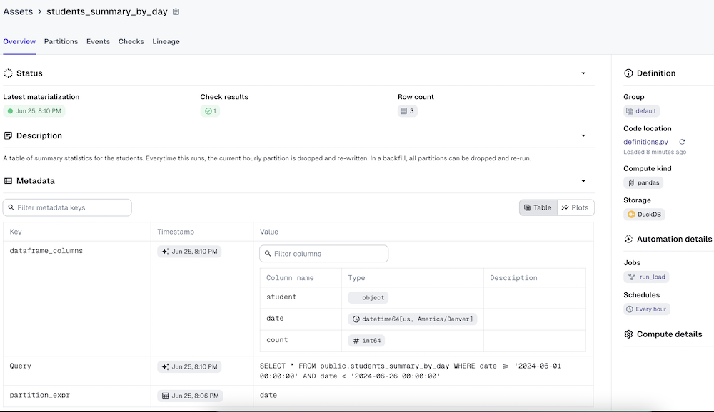

# Dagster & dlt Example


This example shows how to create a pipeline that uses dlt to load data incrementally from an API to a warehouse (DuckDB), and then use Dagster assets to further transform that data and apply data quality checks. 


Documentation is included inline in `definitions.py`. The `app.py` file is a simple web server that will respond to the dlt API requests with fake mock data.

To get started:

```bash
pip install -r requirements.txt
```

```bash
make run 
```

Once Dagster is loaded, navigate to the *Assets* page, select *View global asset lineage*, and click *Materialize all*. When prompted, select *Launch Backfill*.

Note that this example makes use of IO Managers, which are an advanced Dagster concept designed for specific circumstances. Read more [here](https://docs.dagster.io/concepts/io-management/io-managers). In this case, the desired behavior was a good fit for IO Managers:

-  to process data in Python and store it, partitioned, in an easily serializable format
-  automatically collect metadata about the table schemas, row counts, and query


